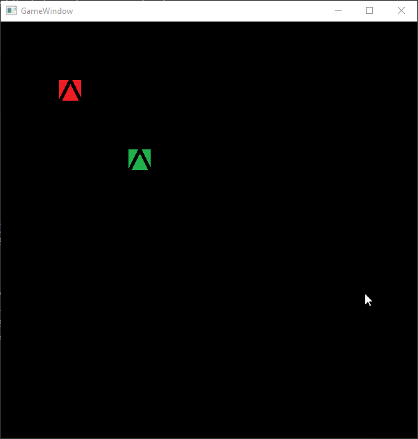

# ExGameLib

Game Engine written in C++ with SFML and ENTT.

I am using this project as a means to learn new technologies and systems. As such, the code is constantly being refactored and played with. 

## Getting Started

### Installation
You will first need SFML, ENTT, chaiscript and nlohman JSON (links to both found below). You can include manually, but using vckpkg you can run the below commands to install each package:
```
vcpkg install sfml:x64-windows
vcpkg install nlohmann-json:x64-windows
vcpkg install entt:x64-windows
vcpkg install chaiscript:x64-windows
```

### Usage

Currently, you can show a window, load entities from a JSON file (including textures) onto the screen, and move them around with custom input mapping.

To do this, `#include "Game.h"` then insert the below in to your main function:

```cpp
EGL::Game game;
```

Create an `entities.json` file and put in the entity attributes in similar to below:
*You will need to ensure the referenced texture files are present.*
```json
{
  "player": {
    "name": "Jimmy",
    "health": 10,
    "texture": "player.png",
    "position": [ 200, 200 ],
    "inputs": {
      "w": "EGL.Move(\"player\", 5);",
      "s": "EGL.Move(\"player\", -5);",
      "a": "EGL.Rotate(\"player\", -5);",
      "d": "EGL.Rotate(\"player\", 5);",
      "r": "EGL.SetPos(\"player\", 0, 0);",
      "t": "EGL.Delete(\"skeleton\");",
      "q": "EGL.Shift(\"player\", -5, 0);",
      "e": "EGL.Shift(\"player\", 5, 0);",
      "p": "EGL.AddPositionComponent(\"player\", 0, 0);" 
    }
  },
  "villager": {
    "name": "Fred",
    "health": 10
  },
  "skeleton": {
    "health": 5,
    "texture": "enemy.png",
    "position":[100, 100]
  }
}
```

When run, the file will be loaded into the game state and the screen will output the entities at the correct with position with the correct texture. The entities can then be moved, rotated, and modified, depending on the player input. 



## Future Plans
- [ ] Replace SFML with lower level graphics implementation, OpenGL most likely

## Libraries Used
- Lohmann N. JSON for Modern C++ (version 3.9.1). URL: https://github.com/nlohmann/json
- SFML - Simple and Fast Multimedia Library (version 2.5.1). URL: https://www.sfml-dev.org/index.php
- ENTT (version 3.8.0). URL: https://github.com/skypjack/entt
